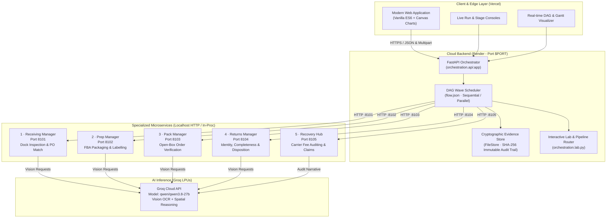
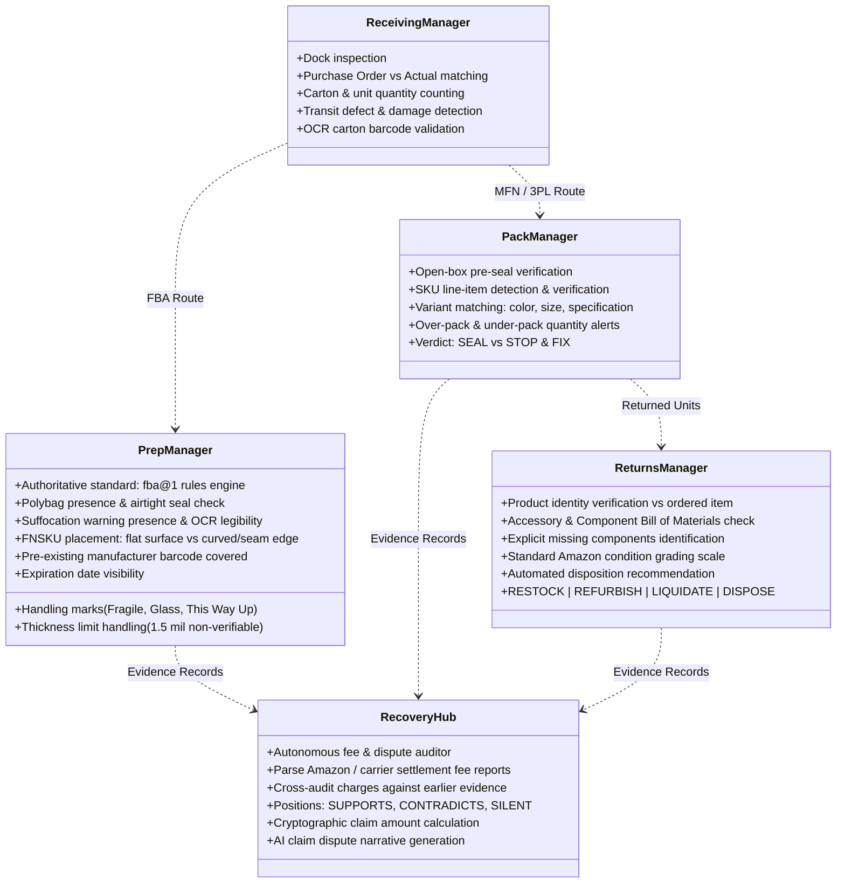
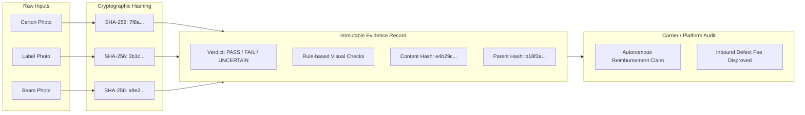
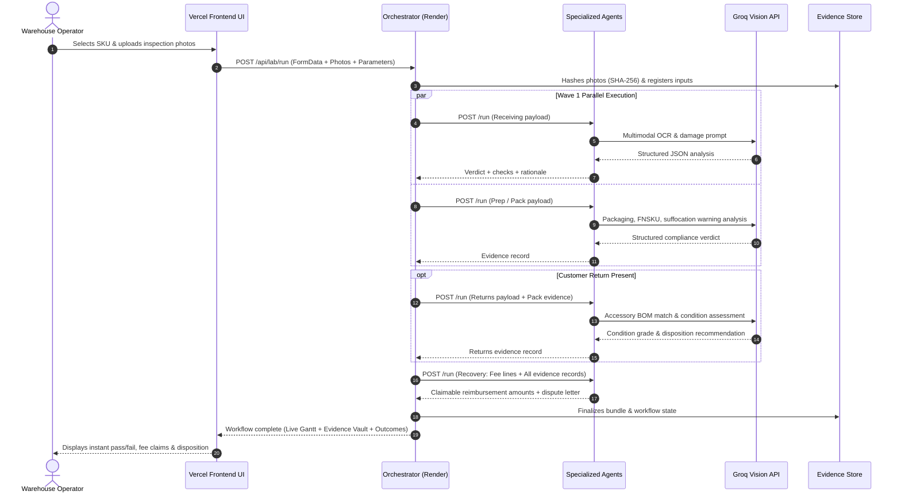

# CUBE Pod 13: System Architecture & Visual Blueprint

This document provides a complete technical walkthrough and visual architecture of **CUBE Pod 13** — the autonomous multi-agent commerce automation platform.

---

## 1. High-Level System Topology

---

## 2. The 5 Specialized AI Agents: Capabilities & Rule Engines

---

## 3. DAG Pipeline Scheduling: Parallel Execution Waves

When processing a shipment unit, the orchestrator calculates dependencies using a Directed Acyclic Graph (DAG) and schedules tasks in overlapping waves:

```mermaid
gantt
    title Parallel Execution Waves (Elapsed Time in Seconds)
    dateFormat X
    axisFormat %s s

    section Wave 1 (Independent)
    Receiving Manager (Dock Inspection) :active, w1_rec, 0, 4
    Prep Manager (FBA Packaging & Labelling) :active, w1_prep, 0, 3

    section Wave 2 (Needs Pack Evidence)
    Returns Manager (Returned Item BOM & Condition) :crit, w2_ret, 4, 9

    section Wave 3 (Needs All Evidence)
    Recovery Hub (Fee Audit & Reimbursement Claims) :done, w3_rec, 9, 11
```

### Dependency Rules:
1. **Wave 1 (`Receiving ∥ Prep` or `Receiving ∥ Pack`)**: Independent photographs and independent domain rules. Run simultaneously over Groq's high-throughput LPU inference.
2. **Wave 2 (`Returns`)**: Compares what came back against what Pack originally sealed; starts after Pack evidence is registered.
3. **Wave 3 (`Recovery`)**: Recovery audits every fee line against all prior records (dock condition, prep compliance, pack records, and return inspection). It waits for all stages to produce their immutable evidence.

---

## 4. Cryptographic Evidence Chain (Immutable Audit Vault)

Every decision produced by any agent is committed to an immutable record conforming to the strict CUBE Evidence Contract:

- **Strict Idempotency**: Running the same payload twice produces identical content hashes. Re-runs never overwrite past evidence.
- **Auditable Lineage**: If a human operator overrides a verdict in the Review Queue, a new revision is appended with `actor`, `reason`, and cryptographic pointer to the previous record. Original evidence is never modified.

---

## 5. End-to-End Operational Lifecycle

---

## 6. Infrastructure & Deployment Architecture

| Component | Platform | URL / Endpoint | Purpose |
|---|---|---|---|
| **Frontend UI** | **Vercel** | `https://cube-round3-pod.vercel.app` | Reactive dashboard, live camera upload, real-time DAG monitor |
| **Backend API** | **Render** | `https://cube-round3-pod-pb6w.onrender.com` | Microservices host, DAG orchestrator, Swagger API docs |
| **Health Check** | Render | `/health` | Live status across all 5 agent microservices |
| **Inference Engine** | **Groq Cloud** | `https://api.groq.com/openai/v1` | `qwen/qwen3.8-27b` multimodal vision model with sub-second execution |
| **Code Repository** | **GitHub** | `https://github.com/HarshKumar5822/cube-round3-pod` | Complete version-controlled codebase with 100% test coverage |
